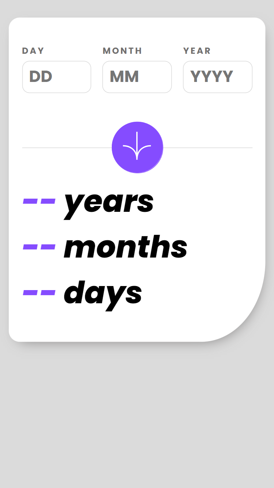
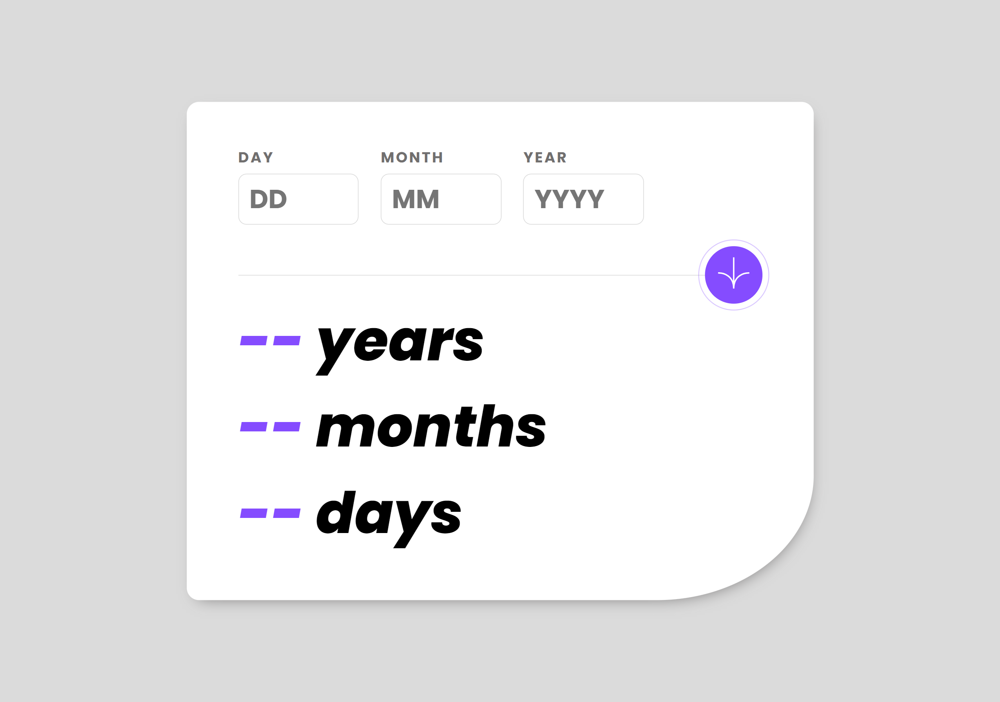

# Frontend Mentor - Age calculator app solution

Hello!

Thank you for taking your time to review my solution to the [Age calculator app challenge on Frontend Mentor](https://www.frontendmentor.io/challenges/age-calculator-app-dF9DFFpj-Q).

## Table of contents

- [Overview](#overview)
  - [The challenge](#the-challenge)
  - [Screenshot](#screenshot)
- [My process](#my-process)
  - [Built with](#built-with)

**Note: Delete this note and update the table of contents based on what sections you keep.**

## Overview

This age calculator app allows users to check how old they are with precision to years, months and days after submitting a valid birthday date.

### The challenge

Users are able to:
- View an age in years, months, and days after submitting a valid date through the form.
- Receive validation errors if:
  - Any field is empty when the form is submitted.
  - The day number is not between 1-31.
  - The month number is not between 1-12.
  - The year or the date in general is in the future.
  - The date is invalid e.g. 31/04/1991.
- View the optimal layout for the interface depending on their device's screen size.
- See hover and focus states for all interactive elements on the page.
- See the age numbers animate to their final number once the form is submitted.

### Screenshot

Mobile view:

Desktop view:

## My process

### Built with

- Semantic HTML5 markup
- SCSS
- TypeScript
- React.js
- React Context
- Animated Numbers library
- Mobile-first workflow